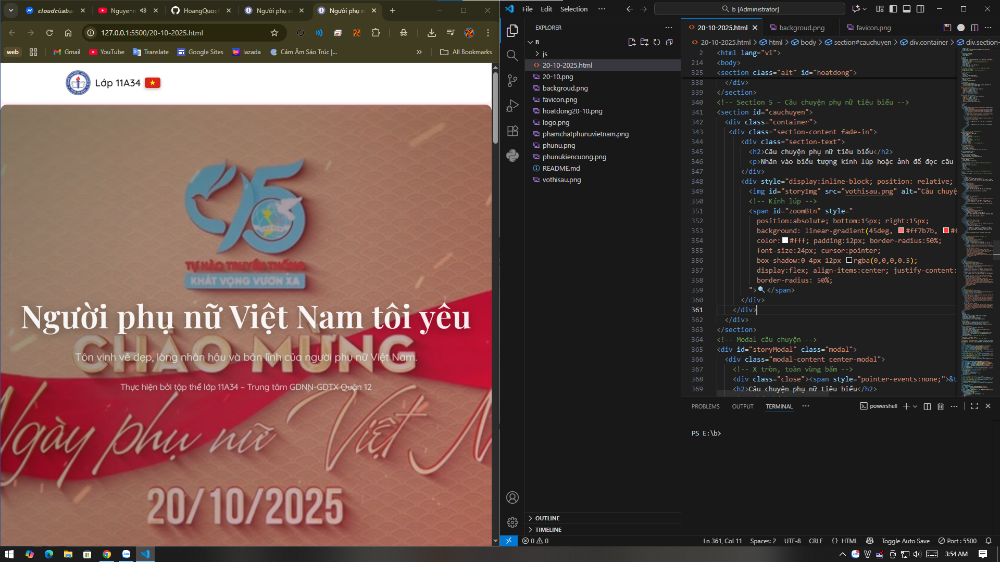
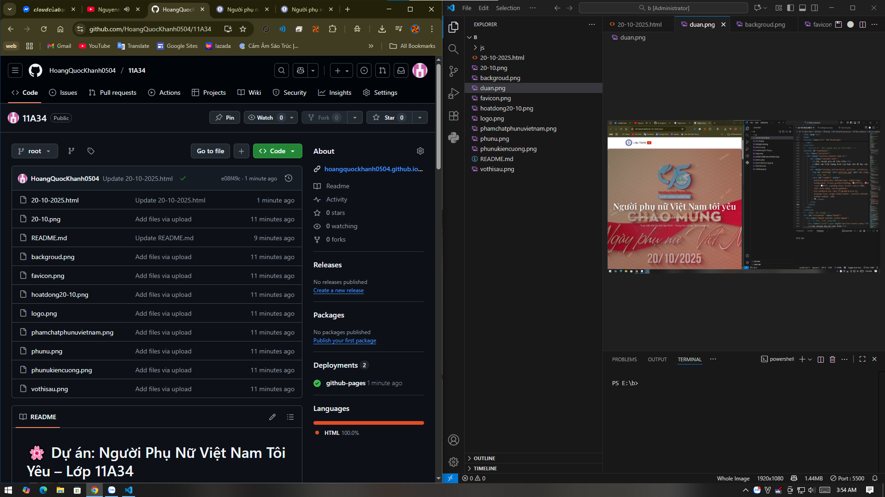

# 🌸 Dự án: Người Phụ Nữ Việt Nam Tôi Yêu – Lớp 11A34

> “Người phụ nữ Việt Nam – dịu dàng như hoa, mạnh mẽ như thép.”  
> — Tập thể lớp 11A34

---

## 💡 Giới thiệu

Đây là **dự án web tôn vinh phụ nữ Việt Nam** nhân dịp **20/10**, được thực hiện bởi **tập thể lớp 11A34 – Trung tâm GDNN-GDTX Quận 12**.  
Trang web giới thiệu ý nghĩa ngày 20/10, các hoạt động kỷ niệm, phẩm chất của người phụ nữ Việt Nam, và những câu chuyện cảm động do chính học sinh biên soạn.

---

## 🖥️ Nội dung chính

- **Phần giới thiệu chủ đề:**  
  Giải thích lý do chọn đề tài và mục tiêu hướng đến.

- **Biểu tượng yêu thương & kiên cường:**  
  Tôn vinh hình ảnh người phụ nữ Việt Nam qua thời đại.

- **Lịch sử ngày 20/10:**  
  Trình bày nguồn gốc và ý nghĩa sâu sắc của ngày Phụ nữ Việt Nam.

- **Hoạt động kỷ niệm:**  
  Liệt kê các hoạt động lớp 11A34 thực hiện để tri ân phụ nữ.

- **Câu chuyện phụ nữ tiêu biểu:**  
  Hiển thị hình ảnh, modal chi tiết, có thể phóng to ảnh và zoom ±.

- **Phẩm chất phụ nữ Việt Nam:**  
  Tóm tắt 4 phẩm chất đặc trưng: Kiên cường – Dịu dàng – Sáng tạo – Hi sinh.

- **Tri ân & cảm xúc:**  
  Lời cảm ơn và chúc mừng từ tập thể lớp 11A34.

- **Lời kết:**  
  Khép lại bằng thông điệp yêu thương và hình ảnh tượng trưng cho hoa – người phụ nữ Việt Nam.

---

## 🎨 Giao diện & Kỹ thuật

- **Ngôn ngữ:** HTML, CSS, JavaScript  
- **Thư viện:** [Bootstrap 5](https://getbootstrap.com/), [Google Fonts](https://fonts.google.com/)  
- **Hiệu ứng:**  
  - Fade-in khi cuộn  
  - Hero section có gradient + overlay mờ  
  - Modal phóng to ảnh với điều khiển zoom ±  
  - Thông báo chạy ngang trong navbar  
- **Thiết kế:** Bo tròn toàn bộ góc, phối màu hồng pastel nhẹ nhàng.  
- **Tối ưu cho:** Cả **máy tính và điện thoại** (responsive).

---

## 🧑‍💻 Thành viên thực hiện

| Vai trò | Họ tên |
|----------|--------|
| Thiết kế & Lập trình chính | **Hoàng Quốc Khánh** |
| Nội dung & ý tưởng | Tập thể **lớp 11A34** |
| Hình ảnh minh họa | Sưu tầm và thiết kế bởi nhóm dự án |
| Cố vấn | **Giáo viên chủ nhiệm lớp 11A34** |

---

## 📷 Ảnh minh họa

---

## 💬 Lời nhắn

> Xin gửi lời chúc tốt đẹp nhất đến tất cả **những người phụ nữ Việt Nam** –  
> những người đã và đang lan tỏa tình yêu, sự hi sinh và nghị lực phi thường.  
>  
> 🌷 Chúc mọi người **mãi xinh đẹp, hạnh phúc và tỏa sáng!**

---

### 📚 Trung tâm GDNN-GDTX Quận 12  
© 2025 – Lớp **11A34**  
Thiết kế & thực hiện bởi [**Hoàng Quốc Khánh**](https://www.facebook.com/khanhpc548)

